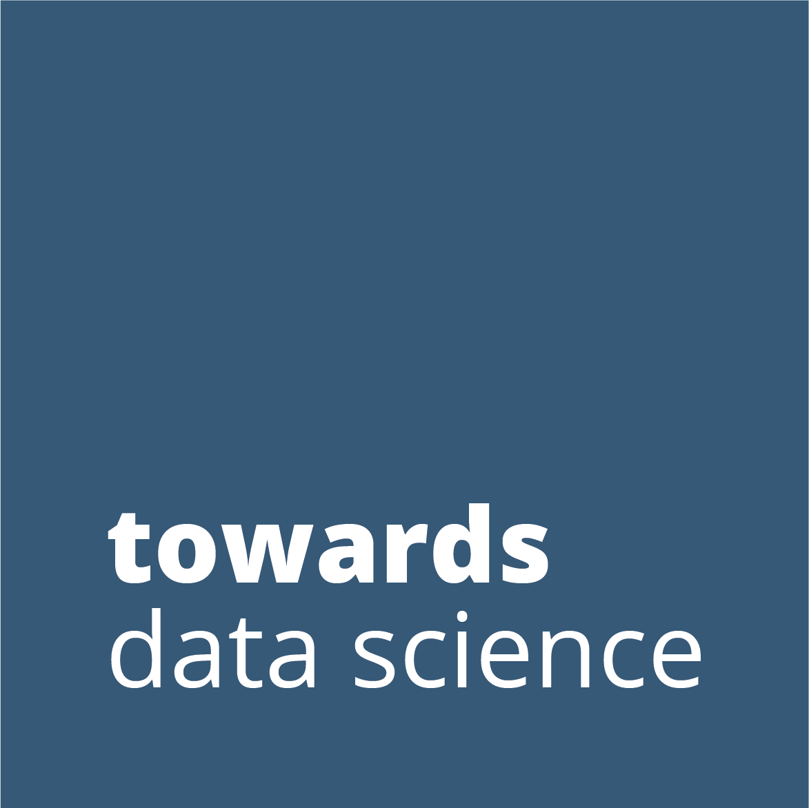

  

- :v: Hola!!!, Welcome to my GitHub. I’m **Utkarsh Ankit**.
- :bulb: I’m a Data Scientist and have a deep interest in Artificial Intelligence and Computer Vision works.
- :rocket: Former ISRO and IIT Research Intern.
- :black_nib: I’m a blogger too, you can find my blogs [here](https://utkarsh-ankit.medium.com/).

<h4> Contact Me:- </h4>

  

 

<h4> Where to find me:- </h4> 

  
  
  
  
  

 <!---
utk-ink/utk-ink is a ✨ special ✨ repository because its `README.md` (this file) appears on your GitHub profile.
You can click the Preview link to take a look at your changes.
--->
